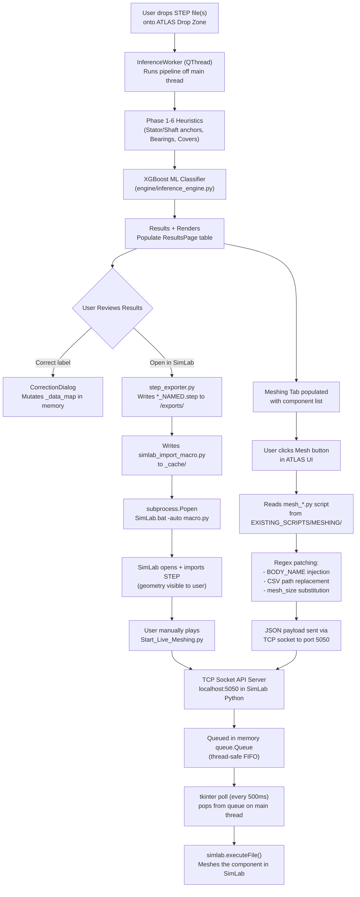

# ATLAS — System Design Analysis & Improvement Roadmap

> [!NOTE]
> This document reflects the architecture as of 2026-07-01. It is a living design reference.

---

## 1. Current System Architecture Overview

ATLAS is a **hybrid AI + CAD automation pipeline** with two distinct runtime environments that must collaborate:

| Layer | Runtime | Purpose |
|---|---|---|
| **ATLAS App** | Python 3.10 + PySide6 (Conda `cv_datagen`) | UI, ML inference, state management |
| **SimLab Executor** | Python 3.8 (SimLab's embedded interpreter) | Mesh execution via `simlab` API |

These two environments **cannot share memory**, so they communicate through a custom-built IPC bridge.

---

## 2. Data Flow: End-to-End



---

## 3. Component Deep Dive

### 3.1 Inference Pipeline (`engine/inference_engine.py`)
- Runs entirely in `InferenceWorker` (QThread) to keep UI responsive
- Captures all `print()` via `_StreamBridge` and routes to debug console
- 6-phase sequential heuristics filter geometry candidates before ML classification
- XGBoost model loaded from `models/` directory on first call (not cached between runs)

### 3.2 State Management (`app.py`)
- **All session state is in-memory dictionaries** on the `App` class:
  - `results_page._data_map`: `{filename: [(comp_name, conf, nodes, is_corrected)]}`
  - `results_page._renders_map`: `{filename: {comp_name: img_path}}`
  - `results_page._paths_map`: `{filename: original_step_path}`
  - `self.last_export_path`: `{filename: exported_step_path}`
- State is serialized to JSON only on explicit **Save Run** action
- **No auto-save** — unsaved state is lost on app close

### 3.3 Run History (`_run_history/*.json`)
- Flat JSON files, one per saved run
- Contains: `version`, `results`, `renders` (image paths), `paths` (original STEP paths)
- Image paths are **absolute** — run history breaks if files are moved/renamed
- No database, no indexing — uses `glob` to list all files

### 3.4 SimLab IPC Bridge (TCP Socket API)

**Architecture:** Talker (ATLAS App) → TCP Socket → Listener (SimLab Python) → In-Memory Queue → SimLab Main Thread Executor

```
ATLAS App (port client)
  │
  │  JSON payload: {"code": "<python mesh script string>"}
  │  → TCP 127.0.0.1:5050
  ▼
SimLab Listener (daemon thread)
  │
  │  conn.recv() → json.loads() → job_queue.put(code)
  ▼
In-Memory queue.Queue (thread-safe FIFO)
  │
  │  tkinter.after(500ms) → job_queue.get_nowait()
  ▼
SimLab Main Thread
  → writes _active_job.py → simlab.executeFile()
```

**Why this design?** SimLab's C++ engine is single-threaded. `simlab.execute()` can **only** be safely called from the main thread. The Queue is the thread-safety boundary.

### 3.5 Mesh Script Dispatch (`app.py: _handle_mesh`)
1. Looks up the script template from `EXISTING_SCRIPTS/MESHING/` by component name
2. Performs 3 regex substitutions before sending:
   - `BODY_NAME = "..."` → injected with actual component name
   - Any `*_area.csv` path → repointed to `EXISTING_SCRIPTS/TEMP/`
   - `mesh_size`, `surf_mesh_size`, `vol_mesh_size` → user-selected value
3. Serializes patched code as JSON, sends via TCP socket

---

## 4. File System Layout

```
hybrid_cad_pipeline/
├── config/               # environment.yml, heuristics_config.yaml
├── core/                 # step_loader.py, feature_extractor.py
├── engine/               # inference_engine.py, step_exporter.py
├── heuristics/           # phase1-6 Python modules
├── models/               # XGBoost .json weights
├── gui/                  # app.py, worker.py, meshing_page.py, styles.py
├── EXISTING_SCRIPTS/
│   ├── MESHING/          # mesh_*.py templates (9 scripts)
│   └── TEMP/             # shaft_area.csv, stator_area.csv written here
├── _cache/               # Runtime artefacts (gitignored)
│   ├── simlab_import_macro.py   (generated per run)
│   ├── Start_Live_Meshing.py    (generated per run)
│   └── _active_job.py           (transient, deleted after execution)
├── _run_history/         # *.json saved session reports
└── exports/              # *_NAMED.step outputs
```

---

## 5. High-Level Improvement Areas

### 🔴 Critical (Reliability / Data Integrity)

#### 5.1 Fragile State Persistence
**Problem:** All session state lives only in Python memory. A crash, accidental close, or Python exception destroys unsaved work — including manual label corrections.

**Improvement:** Implement **auto-save on every mutation**. Every label correction, removal, or render add should immediately write a `_cache/autosave.json`. The app should check for and restore this on startup.

---

#### 5.2 TCP API has no ACK / Error Feedback
**Problem:** The current TCP dispatch is "fire and forget". After the ATLAS app sends a JSON payload, it has no idea if SimLab actually received it, queued it, or crashed during execution. The UI just shows "Dispatched" with no guarantee.

**Improvement:** Implement a **request-response protocol**. SimLab's listener should send back a simple JSON `{"status": "queued"}` or `{"status": "error", "msg": "..."}` before closing the connection. The ATLAS app should read this response and update the progress bar accordingly.

---

#### 5.3 Absolute Image Paths in Run History
**Problem:** Render image paths stored in `_run_history/*.json` are absolute (e.g., `F:\02.CAE\ATHARVA\...\render.png`). Loading a run history on any other machine or after moving the project folder will silently fail to show images.

**Improvement:** Store **relative paths** from `_ROOT` inside JSON. Resolve to absolute paths at load time.

---

### 🟡 Significant (Architecture / Scalability)

#### 5.4 Monolithic `app.py`
**Problem:** `app.py` is ~1,650 lines handling UI layout, state management, SimLab IPC logic, mesh script dispatch, run history I/O, and CAD export — all in one file. This makes the code hard to navigate, test, and extend.

**Improvement:** Split into purpose-specific modules:
- `gui/app.py` → pure UI assembly and event wiring
- `gui/session.py` → state management (_data_map, _renders_map, save/load)
- `bridge/simlab_bridge.py` → all SimLab IPC (macro generation, TCP dispatch)
- `bridge/mesh_dispatcher.py` → mesh script loading and patching

---

#### 5.5 XGBoost Model Loaded Per-File (No Caching)
**Problem:** `inference_engine.py` likely loads the XGBoost model from disk on every call to `infer_cad()`. In batch mode (10+ files), this results in repeated disk reads and model deserialization for each file.

**Improvement:** Load the model once when the `InferenceWorker` starts and pass it as an argument to each `infer_cad()` call.

---

#### 5.6 No Concurrent Mesh Jobs / Job Queue Visibility
**Problem:** The mesh queue is opaque. You have no visibility into what is waiting, what is running, or what failed. If you click "Mesh All", 10 jobs are silently queued and only the last dispatched one shows in the status bar.

**Improvement:** Add a **Job Queue Panel** to the Meshing Tab showing pending, active, and completed jobs with status indicators (🟡 Queued, 🔵 Running, ✅ Done, ❌ Failed).

---

### 🟢 Quality of Life

#### 5.7 SimLab Listener Requires Manual Script Playback
**Problem:** After every SimLab launch, you must go to *Automation → Scripting → Play* manually to start the API server. This is a 3-click tax on every session.

**Best Possible Improvement (within SimLab's constraints):** Create a SimLab **Toolbar Button** that plays `Start_Live_Meshing.py`. SimLab supports custom toolbar buttons defined in its configuration XML. This reduces it to 1 click. This is the closest achievable approach without crashing SimLab.

---

#### 5.8 `BODY_NAME` Injection Can Break Duplicate-Numbered Components
**Problem:** For components like `OUTER_RACE_1`, regex replaces `BODY_NAME = "OUTER_RACE"` with `BODY_NAME = "OUTER_RACE_1"`. However if the mesh script internally creates groups named `"OUTER_RACE_Logo_Faces"`, those string literals are **not** updated, and SimLab may fail silently.

**Improvement:** Add a second regex pass to replace `"OUTER_RACE"` (the base name) inside group name strings within the template with the full `comp_name`.

---

#### 5.9 Conda Environment Not on System PATH
**Problem:** The Miniconda installation is inside the project folder (`/miniconda3/`). It requires the user to call the full path to `conda.exe` or `python.exe` every time. There is no `conda activate` shortcut without first running `conda init`.

**Improvement:** Add a `setup.bat` / `setup.ps1` script to the project root that runs `conda init powershell`, prints activation instructions, and optionally creates a desktop shortcut that opens PowerShell pre-activated in the correct environment.

---

## 6. Summary Priority Table

| # | Issue | Impact | Effort |
|---|---|---|---|
| 5.1 | Auto-save on mutation | 🔴 High | Low |
| 5.2 | TCP ACK / error feedback | 🔴 High | Low |
| 5.3 | Relative image paths in history | 🔴 High | Low |
| 5.4 | Split monolithic `app.py` | 🟡 Medium | High |
| 5.5 | Model caching across files | 🟡 Medium | Low |
| 5.6 | Mesh job queue visibility | 🟡 Medium | Medium |
| 5.7 | SimLab toolbar button | 🟢 Low | Medium |
| 5.8 | Group name injection for duplicates | 🟢 Low | Low |
| 5.9 | `setup.bat` for new workstations | 🟢 Low | Low |
